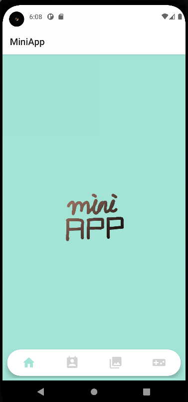

# MiniApp

몰입캠프 1주차

## Content 

>Tab1: Home   
따로 구현한 사항은 없다

   

> Tab2: Contacts
스마트폰에 있는 연락처 권한을 받아 리사이클러뷰를 이용해 핸드폰에 보여준다.

> Tab3: Gallery

사진 추가 버튼을 누르고 스마트폰에 저장된 이미지를 가져와 리사이클러뷰의 그리드매니저레이아웃을 이용해 보여주고 
사진 터치시 사진을 확대하여 보여주고 viewPager와 PhotoView라이브러리를 이용해서 줌 인/아웃 기능을 추가했다.

> Tab4: Game

가속도 센서와 진동센서를 이용해서 만든 간단한 낚시 게임이다

