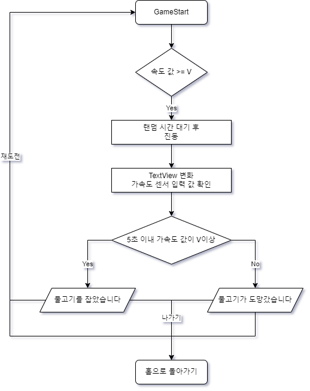

**목차** 
- [MiniApp](#miniapp)
  * [Content](#content)
    + [Tab1: Home](#tab1--home)
    + [Tab2: Contacts](#tab2--contacts)
    + [Tab3: Gallery](#tab3--gallery)
    + [Tab4: Game](#tab4--game)
  * [Detail](#detail)
    + [전체 순서도](#------)
    + [사용한 라이브러리](#---------)

   
---
# MiniApp

몰입캠프 1주차 프로젝트.

## Content

### Tab1: Home

직접 그림을 그려 HomeFragment에 넣었다. 이외에는 기능없음

---

### Tab2: Contacts

스마트폰에 있는 연락처를 연동해서 Recyclerview로 보여준다.   

   
`getcontact()`로 사용자에게 연락처 접근 권한을 얻고, `contactinfo.kt`을 통해 JSON 형식으로 데이터를 가져와 parsing한다. 이름과 연락처는 adapter에서 bind해서 fragment로 넘긴다. 프로필 사진은 google처럼 이름의 첫 글자를 가져온 뒤, 랜덤으로 컬러를 지정했다. 이때, 즐겨찾기 기능처럼 오른쪽 하트를 누르면 lottie애니메이션이 실행되며 하트 색상이 변경된다.

---

### Tab3: Gallery

사진 추가 버튼을 누르고 스마트폰에 저장된 이미지를 가져온다.(Bundle을 사용해서 Fragment에 정보를 전달)
가져온 이미지를 리사이클러뷰의 그리드매니저레이아웃을 이용해 이미지를 한줄에 3개씩 보여준다.
사진 클릭시 `PhotoFragment`에서 intent로 갤러리에서 가져온 이미지를 전달한다. viewpager2와 photoview를 사용해 슬라이드, 줌 인/아웃 기능을 구현했다.   

---

### Tab4: Game

가속도 센서와 진동센서를 이용해서 만든 간단한 낚시 게임이다.

navigation bar를 통해 game tab로 이동하면 ‘낚시하기’ 버튼이 있다. 해당 버튼을 누르면 `gameactivity`가 실행된다. 낚싯대와 배에 조금씩 흔들거리는 Tween 애니메이션을 넣었다. 이후 휴대폰을 한번 흔들면 낚싯대가 던져진다. 일정 시간 이후 물고기를 잡으라는 Textveiw가 뜨고 5초의 시간을 센다. 다시 한 번 휴대폰을 흔들면 물고기를 건져 올릴 수 있다. 만약 흔들지 않을 경우, 물고기가 달아난다. dialog를 통해 잡은 물고기, 혹은 물고기를 놓쳤다는 알림이 나타난다. 이때 dialog는 fragment로 따로 만들어줬고, *`supportFragmentManager`* 를 사용해서 창을 띄운다. 잡은 물고기의 종류는 랜덤이다.   
   

---

## Detail

### 전체 순서도

메뉴 : 하단 스크롤시 숨겨짐, 상단 스크롤시 다시 나타남(CoordinatorLayout 사용)

---

### 사용한 라이브러리

- Glide
- PhotoView
- LottieAnimationView

*app/app-debug.apk를 다운 혹은 우측의 링크를 클릭시 앱을 다운로드 할 수 있습니다.*[클릭시 다운로드](https://github.com/sihyeong671/MiniApp/raw/main/app/app-debug.apk)
